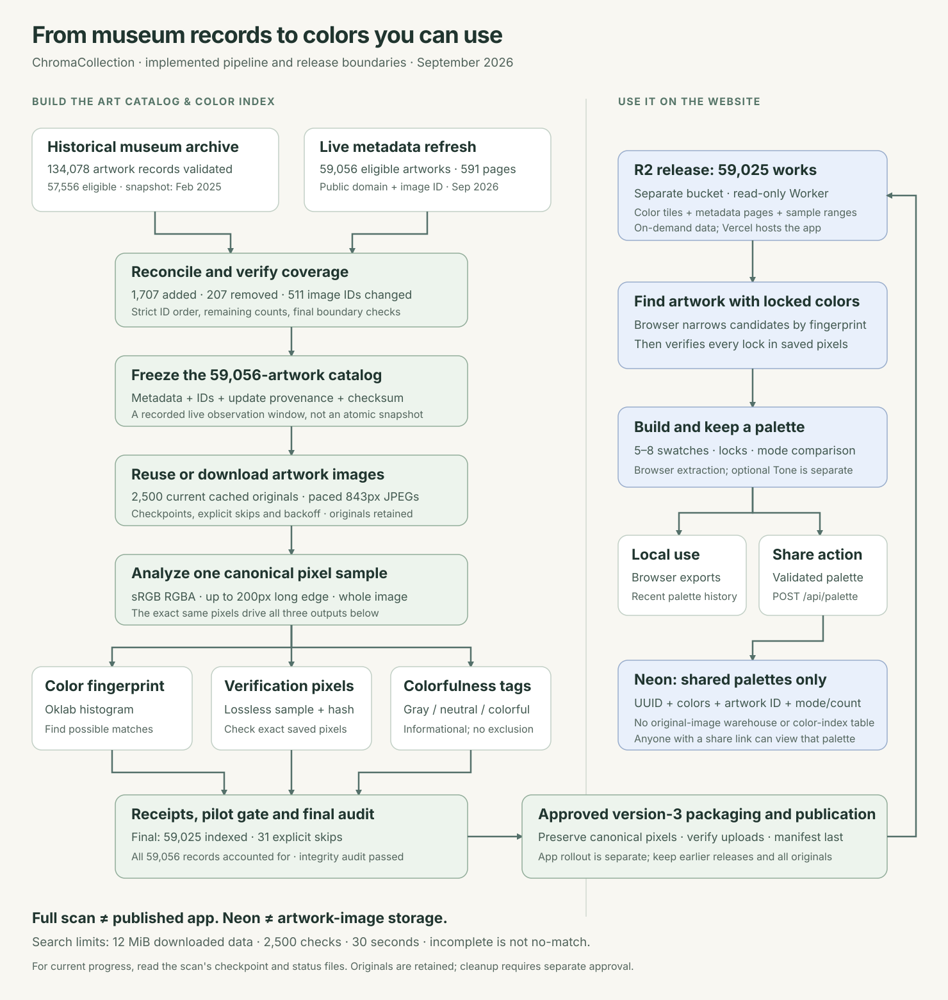

# ChromaCollection

A web app that extracts color palettes from artworks in the [Art Institute of Chicago](https://www.artic.edu/) collection.

Browse and search the museum collection, explore artwork, and generate downloadable color palettes for your creative projects. Locked-color matching currently uses the local 2,500-artwork index; the larger scan is separate from the app's published assets.

## Documentation

Start with the [complete documentation hub](docs/README.md), the [website guide](docs/user-guide.md), or the [illustrated explanation of how we built the artwork database](docs/data-pipeline.md). Technical readers can continue to [architecture](docs/architecture.md), [API and schema reference](docs/api-reference.md), [operations and scan monitoring](docs/operations.md), and [decisions and limitations](docs/decisions-and-limits.md).



## Features

- **Search & Random** — find artworks by keyword or discover random pieces
- **Color Extraction** — dominant (by brightness) and vibrant (by saturation) modes
- **Adjustable Palette** — 5 to 8 colors per palette
- **Export** — JSON, CSS variables, PNG swatch strip, Adobe .ASE
- **Shareable Links** — save palettes to a database and share via short URL
- **Color locks** — keep selected swatches in their slots while regenerating the rest; locks survive random artwork rerolls, search selections, and mode changes
- **Mode comparison** — compare dominant and vibrant palettes side by side; request tone separately, then apply any result with your locks intact
- **Discovery filters** — combine artist, medium, period, and public-domain filters, browse pages, or explore more by the selected artist
- **Recent palettes** — restore your last 24 palettes, locks, and tone descriptions from this browser, without making another AI request
- **Contrast guidance** — check text/background pairs, see AA thresholds, and copy a suggested accessible text color
- **Artwork cards** — export a 1200×1440 PNG containing the artwork, palette, hex values, museum link, and attribution
- **One-screen workbench** — artwork, palette locks, color count, mode, and Random fit the desktop and mobile viewport. Search, palette tools, history, exports, and full artwork details open in dismissible right-side drawers on desktop and bottom sheets on mobile; longer panels scroll internally. Desktop swatches support click-to-copy plus separate lock buttons. Seven or eight mobile colors use two rows to keep swatches tappable. Very short viewports retain scrolling for accessibility instead of clipping controls.

With locks, **Random matching art** searches the bundled **2,500-artwork public-domain index**, not a fresh random sample from the museum. It retrieves possible matches from saved color signatures, verifies the original saved pixel samples against **every** lock, and prefers artworks outside your recent history. Only the selected artwork's display/palette image needs a museum download. The index and a bounded cache of verified samples are reused for later searches; there is no fallback to the old 36-image scan. A spinner and stable “Finding a match…” message replace per-candidate counts; reduced-motion preferences are respected.

Matching uses the entire canonical sample at up to 200 pixels per side, including backgrounds, frames and display cases: each locked color needs at least 1% of opaque pixels within an Oklab distance of 0.03. Colored locks (Oklab chroma at least 0.015) additionally require those same pixels to retain at least half the lock's chroma and be within 25 degrees of its hue. Neutral locks have no hue requirement. Exact locked hex values stay unchanged. These guards reject the reported gray/green and gold/sepia cases; broader human calibration is still needed. This is approximate image-color matching within a starter subset, **not a whole-collection guarantee**. Search feedback clears on success. A complete no-match is distinguished from unavailable/incomplete index data; either leaves the artwork and palette intact. Without locks, Random remains unrestricted. Manual search selection is not color-filtered.

Restoring history restores that snapshot’s locks. Unlock any slot beyond a smaller requested color count before reducing the count. Comparisons show original extraction results; applying them preserves locks. History is local to the browser and falls back to session-only storage when storage is unavailable. Clear it from the recent-palettes shelf.

Artwork-card exports include the museum's rights information; consult the linked museum page before reusing an image. Contrast guidance follows the [WCAG text contrast thresholds](https://www.w3.org/WAI/WCAG22/Understanding/contrast-minimum.html) for opaque colors. Discovery uses the [AIC search API](https://api.artic.edu/docs/).

## Precomputed color index

Unlocked Random is not a uniform draw from the whole collection: it currently samples from at most 10,000 listing positions and does not apply the discovery form's filters. The [website guide](docs/user-guide.md#what-random-does) explains the different search and Random behaviors.

The [color-index guide](docs/color-index.md) describes the current release, format, build process and limitations. The active index lives at `static/color-index/expanded-2500-20260913/`; the previous 481- and 965-artwork releases are retained for rollback. Original museum JPEGs are not bundled. No new dependencies or database schema changes were needed for the index. See the [release checklist](docs/release-checklist.md) for the isolated Neon development setup, passing local sharing checks, and remaining release gates.

To prepare a new bounded corpus, run `pnpm colors:download --output /path/new-download-directory --limit 500`. This downloads public-domain images sequentially with at least one second between requests. Then build a **new** release directory with `pnpm colors:index --manifest /path/manifest.json --catalog /path/artworks.json --output /path/new-index-directory`. Inspect the reports, verify representative queries, and update the versioned asset path before switching releases. Existing outputs are never overwritten. See the guide before expanding beyond the starter corpus.

To extend a completed corpus without re-downloading its images, add `--extend-manifest /previous/manifest.json --extend-catalog /previous/artworks.json` and choose a total `--limit` up to 2500. Existing source files and matching public-domain metadata are validated and referenced in the new manifest. Failed new downloads are replaced from the candidate pool; exhausting that pool can leave the result below target. This is reuse of completed downloads, not automatic recovery of an interrupted run.

## Stack

- [SvelteKit](https://svelte.dev/) + [Tailwind 4](https://tailwindcss.com/)
- [Art Institute of Chicago API](https://api.artic.edu/docs/) (public, no auth)
- Canvas API + k-means clustering for color extraction
- [Neon](https://neon.tech/) (serverless Postgres) for shareable palette links

## Setup

```bash
# install dependencies
npm install

# set up environment in a fresh checkout (do not overwrite an existing .env)
cp .env.example .env
# add a development-branch Neon DATABASE_URL to .env, never production

# initialize only a new development database without the palettes table
npx tsx scripts/init-db.ts

# start dev server
npm run dev
```

## Environment Variables

| Variable | Description |
|---|---|
| `DATABASE_URL` | Neon Postgres connection string; use the isolated development branch locally |
| `GEMINI_API_KEY` | Server-side Gemini key for on-demand tone generation |

## Verification

For resumable local metadata/signature extraction and exploratory grayscale tagging, see [Local color batches](docs/local-color-batches.md). Batches retain originals and do not alter the app's published index or database.

For a complete, dated metadata baseline from the museum's bulk archive, see [Full artwork catalog](docs/full-artwork-catalog.md). The available snapshot is historical and needs live reconciliation before release.

The approved [full color scan](docs/full-color-scan.md) refreshes that baseline, checks a larger pilot, and scans the frozen catalog locally with restart checkpoints and a final audit.

Run `npm test`, `npm run check`, and `npm run build`. Database access is initialized only for persistence queries, so builds and local image/palette features do not require database credentials. Sharing returns a useful temporary-unavailability response if the database is unavailable.

Palette saves accept bounded JSON (16 KB), validate all swatches and counts, and reject cross-site browser submissions. Saves and tone generation have best-effort per-instance burst limits, not a distributed quota. Tone makes one provider call per action with a 30-second timeout and validates the response before returning it. A saved link remains accessible when the clipboard or phone share sheet is unavailable. See the release checklist for deployment-wide abuse controls and hosted environment isolation.

## License

MIT
