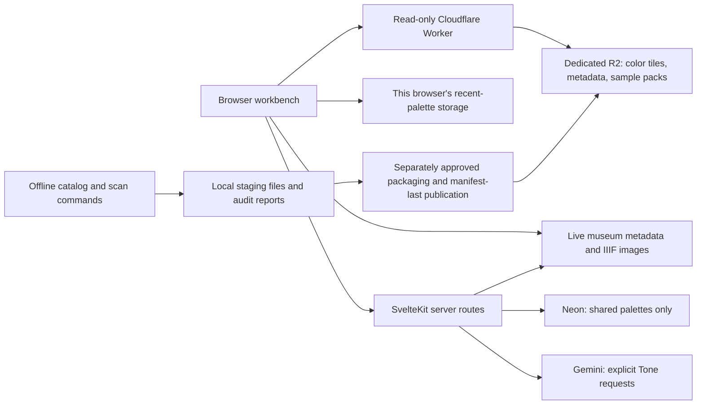

# Architecture and algorithms

[Documentation home](README.md) · [Data pipeline](data-pipeline.md) · [API reference](api-reference.md)

## System boundaries

ChromaCollection is a Svelte 5/SvelteKit application with a browser workbench, a small set of server routes, and separate Node/TypeScript data-processing commands. Tailwind 4 and project CSS provide presentation. The full-index app is deployed on Vercel at [ChromaCollection](https://www.chromacollection.online); its versioned color data is hosted separately in R2. See [dated release evidence](release-checklist.md).

The offline process is not part of an incoming browser request. A visitor does not start a full-collection scan by opening the site, clicking Random, or saving a palette.

## Source map and ownership

| Area | Source | Responsibility |
|---|---|---|
| Main workbench | [`src/routes/+page.svelte`](../src/routes/+page.svelte) | Artwork selection, locks, modes, sheets, history, exports, sharing, request ownership |
| Presentation | [`src/app.css`](../src/app.css), [`src/lib/components/`](../src/lib/components/) | Layout, palette controls, comparisons, contrast, accessible color pickers |
| Museum client | [`src/lib/api/artic.ts`](../src/lib/api/artic.ts) | Structured discovery queries, artwork metadata, image and museum URLs |
| Browser extraction | [`src/lib/colors/extraction.ts`](../src/lib/colors/extraction.ts) | Image loading, small Canvas samples, k-means palettes, color conversions |
| Artwork image loading | [`src/lib/images/artwork-image.ts`](../src/lib/images/artwork-image.ts), [`ArtworkImage.svelte`](../src/lib/components/ArtworkImage.svelte) | Museum/proxy requests, verified preview fallback, cancellation, recovery and object-URL ownership |
| Preview presentation | [`preview-treatment.ts`](../src/lib/images/preview-treatment.ts) | Shared film treatment for display/card exports, isolated from extraction pixels |
| Workbench color tools | [`src/lib/colors/workbench.ts`](../src/lib/colors/workbench.ts) | Lock application, contrast ratio, readable text suggestions |
| Indexed matching | [`src/lib/colors/color-index.ts`](../src/lib/colors/color-index.ts), [`indexed-search.ts`](../src/lib/colors/indexed-search.ts) | Index validation, conservative candidates, strict pixel acceptance, cache ownership |
| Metadata validation | [`src/lib/colors/index-catalog.ts`](../src/lib/colors/index-catalog.ts) | Public-domain catalog normalization and unique identity |
| History | [`src/lib/history.ts`](../src/lib/history.ts) | Bounded local snapshots and defensive parsing |
| Search history | [`src/lib/search-history.ts`](../src/lib/search-history.ts) | Discovery filters, exact request reconstruction, bounded recent searches and defensive parsing |
| Sharing persistence | [`src/lib/db/index.ts`](../src/lib/db/index.ts) | Lazy Neon connection and parameterized saved-palette queries |
| Request boundaries | [`src/lib/server/`](../src/lib/server/) | Bounded input, provider-output validation, per-instance write limits |
| Offline build tools | [`scripts/`](../scripts/) | Catalog import/refresh, source downloads, sample generation, scan supervision/audits |
| Sharded data contracts | [`color-shards.ts`](../src/lib/colors/color-shards.ts) | Typed manifest, directory, tile and metadata validation |
| Release packaging/delivery | [`shard-builder.ts`](../scripts/lib/shard-builder.ts), [`workers/color-index/`](../workers/color-index/) | Lossless packaging and read-only, range-bounded R2 delivery |

## Workbench state and asynchronous ownership

The page owns artwork, current colors, locks, mode/count, comparison alternatives, and recent entries using Svelte runes. Components receive values and callbacks; a lock is not independently owned by a swatch component or by the current artwork.

`PaletteEditor` renders the same separate copy and lock buttons in the desktop dock, mobile main palette, and tool panel. Container queries fit whole hex labels without changing their type size. The page owns clipboard feedback and its timer; request identity prevents an older completion from replacing newer feedback. A persistent live status region sits in the active main view or the modal footer, so copying never changes lock state or steals focus.

Desktop and mobile use viewport-sized main layouts with one shared native dialog for Search, Palette tools, History, Save, and artwork details. CSS presents that dialog as a right-side drawer at 1,024px and above, or a bottom sheet below that breakpoint. `activePanel` selects content; the dialog owns modal focus and `panelOpen` reflects its state in desktop navigation. Crossing the layout breakpoint closes an open panel. Only the dialog content scrolls at normal window heights; very short windows allow main-page scrolling so controls remain reachable. Full metadata and long Tone descriptions stay in the panels instead of increasing the main viewport height.

Artwork selection, palette generation, comparisons, discovery searches, and sharing use request counters. A completion checks that it still belongs to the current request before changing state. This prevents an older response from replacing a newer selection. These guards are not equivalent to cancelling every upstream request: some work may finish after its result has become irrelevant.

Locked-color matching additionally uses an `AbortController`, combined with a 30-second deadline. User cancellation and component teardown stop that search. The browser's indexed-search instance shares bounded, verified public asset caches between matching and image-preview lookup. Queries, locks, and palettes are not stored in that shared instance; module initialization performs no network or DOM work during SSR.

Selecting new artwork resets transient palette/comparison/share state and returns to Dominant mode, while preserving workbench locks. Restoring history explicitly restores the historical lock snapshot. Applying a mode variant preserves current locks. These are distinct operations and should stay distinct in future refactors.

## Three color pipelines

### 1. Browser palette generation

The selected museum image is loaded directly first, with a same-origin image-proxy fallback. Ordinary large images request 843px; narrower originals use bounded derivatives instead of enlargement. Each fetch attempt has a 15-second request timeout. If both paths fail or cannot decode, image loading looks up the artwork ID in the released directory, checks the current image ID against the indexed metadata, and verifies the saved sample's range, decompression bounds, dimensions, and hash. This lookup has a separate 15-second deadline and the existing 12 MiB download budget; it does not query color tiles. Unindexed, changed, explicitly non-public-domain, or corrupt inputs fail closed.

The browser draws the **unfiltered** source onto a Canvas no larger than 100px on either dimension and collects pixels with alpha at least 128. Cached previews are capped at 32 PNG blobs; original museum images are not persisted by this module. A separate presentation function applies the accepted light grain/blur/vignette for displays and artwork-card exports. Its upscaled PNG is a presentation surface, not recovered image detail. Native display images still load directly without requiring CORS; a displayable sharp image is not replaced merely because extraction needed its own fallback. Each image view owns its recovery request and object URL, ignores stale completions, and allows an explicit retry. Exports label low-resolution imagery inside the PNG.

For palette generation only, pixels with average RGB brightness below 15 or above 245 are omitted. K-means uses the requested number of clusters, random initial pixel positions, Euclidean RGB distance, and ten iterations. Empty clusters retain their previous centroid. Centroids become hex/RGB/HSL color objects.

Dominant sorts the resulting swatches by HSL lightness descending. Vibrant sorts by HSL saturation descending. Both currently use this same implementation, although separate invocations can produce different cluster centers because initialization is random. The installed `node-vibrant` dependency is used by offline image analysis, not by the current browser Vibrant palette algorithm.

### 2. Indexed artwork matching

Offline preparation decodes an explicitly sRGB source and downsizes it, preserving aspect ratio, to a maximum 200px long edge. Those exact RGBA bytes drive both the histogram and later verification. Black, white, gray, backgrounds, frames, and cases remain. Alpha below 128 is ignored when counting eligible pixels.

Color comparison uses the project's sRGB-to-Oklab implementation, based on [the Oklab author's reference conversion](https://bottosson.github.io/posts/oklab/). A histogram quantizes each Oklab coordinate onto a 0.02 grid. This is a numerical color index, not an AI embedding or a semantic vector database.

Histogram bins are approximate. Candidate retrieval accounts for bin-rounding distance so a bin-center approximation does not silently reject a potential strict match. Final acceptance loads and hashes the canonical sample and checks the actual saved pixels. It does not re-download the museum JPEG or use a differently resized browser reconstruction.

| Runtime lock rule | Value |
|---|---|
| Maximum Oklab distance | 0.03 |
| Minimum opaque-pixel coverage per lock | 1% |
| Colored-lock threshold | Oklab chroma ≥ 0.015 |
| Minimum matching chroma for colored locks | Half the lock's chroma |
| Maximum hue difference for colored locks | 25° |
| Neutral locks | Distance/coverage apply; no hue guard |

Every relevant condition must be met by the **same qualifying pixels** for a given lock. Every lock must pass in one artwork. The smaller five-to-eight-swatch browser palette is not used as proof that a lock occurs in the image.

`/color-index/release.json` selects the immutable version-3 R2 root and manifest hash for 59,025 audited artworks. The browser loads the directory, relevant color tiles, metadata pages, and exact gzip sample ranges on demand. Identity, dimensions, ranges, decompression bounds, and hashes are validated. Caches retain 16 MiB of decoded assets, eight metadata pages, and 32 verified samples. A query is limited to 12 MiB downloaded bodies, 2,500 checks, and the 30-second UI deadline.

Candidate loads overlap in windows of four to reduce network round trips. Results are considered in their random draw order, not completion order, preserving unbiased selection within the unseen/seen tiers. At most three extra samples can be prefetched when an earlier candidate matches; no new window starts after a match. These downloads share the same byte budget.

The current artwork is excluded. Candidate order is randomized, unseen IDs are preferred, and already-seen valid results may be used as a fallback. Exhausted verified rejections produce no-match; missing/corrupt samples and budget exhaustion produce incomplete data. Neither outcome is converted into a hidden live museum-image scan.

### 3. Interpretive Tone

Tone requests a 400px artwork JPEG through the same loader, then posts its bytes to the same-origin tone endpoint. During image failure, an available unfiltered saved sample is encoded as a JPEG first; the grain/blur display is never sent to the provider. The server validates the upload and count, applies its burst limits, and makes one configured Gemini request. The current code names `gemini-2.5-flash-lite`; that is an implementation setting, not a recommendation about the latest provider model.

The prompt requests a mood description and named colors capturing the artwork's feeling, including colors not literally present. Returned JSON is normalized and validated before the browser accepts it. The server key is sent in the provider request header, never exposed to the browser or placed in the provider URL. There are no automatic provider retries. See the [API reference](api-reference.md) for size/deadline/error details.

## Staging, release assets, and Neon

Full-scan receipts and gzip samples are a resumable **staging format**. The separately invoked v3 packager preserves canonical samples in packs and emits directory, tile, and metadata assets. The uploader publishes the manifest only after data uploads are verified. The app's root/hash pointer selects one immutable release; scanning itself never changes production. Older aggregate v2 assets remain for matching older app deployments.

Neon persists share links only. `getSql()` reads the private connection setting when a save/load query is needed; importing the module or building the app does not initialize a database connection. Inserts and lookups use the driver's parameterized SQL tagged template. Database exceptions are redacted at the relevant routes.

The real table uses integer artwork IDs and counts, JSONB colors, text mode/ID, and a timestamp. Some older high-level project notes show a different sketch; the [API/schema reference](api-reference.md#saved-palette-schema) follows the current implementation.

## External data flows

| Action | Data crossing the boundary | Destination |
|---|---|---|
| Search/discovery | Search terms and selected filters | Museum metadata API |
| Display/extract artwork | Public image identifier and image bytes; verified sample-range requests only when needed | Museum IIIF service, same-origin proxy, or read-only R2 gateway for a saved preview |
| Match locked colors | Relevant color-tile, metadata and sample-range requests; matching is local | Read-only Cloudflare Worker and dedicated R2 bucket, not an AI service |
| Tone generation | Small selected artwork JPEG and requested count | App server, then configured Gemini endpoint |
| Share palette | Artwork ID, color objects, mode, count | App server, then Neon |
| Open shared link | UUID lookup and artwork metadata request | App server to Neon and museum |
| Recent history | Palette/artwork/lock snapshot | Browser-local storage |
| Recent searches | Last 10 completed queries, filters and results-page positions; results are fetched live | Browser-local storage, separate from palette history |
| Fonts and analytics | Browser requests to configured external resources | Google font services; Vercel Analytics in production builds |
| Full scan | Public metadata/image requests; local result writes | Museum to local processing machine |

This is an implementation inventory, not a substitute for a published privacy policy or a legal assessment of provider practices. Production analytics behavior should be reviewed before making claims about tracking or anonymity.

## Performance and reliability boundaries

The static index trades advance processing/storage for faster repeated matching. It does not mean that a visitor downloads every sample or that every query is equally fast. Initial index loading, randomized candidate order, device speed, sample fetches, and no-match exhaustion all affect latency.

Checksums detect wrong or corrupted samples; they do not prove perceptual accuracy, museum rights, or authenticity of upstream artwork content. The sRGB interpretation and default offline resize algorithm are part of the recipe. Embedded JPEG ICC profiles are explicitly skipped by the downloader/batch path rather than silently normalized. The older standalone builder relies on the manifest's sRGB contract.

See [decisions and limits](decisions-and-limits.md) before changing color-space thresholds, excluding backgrounds or grayscale work, publishing a larger index, or moving the search to a server.
