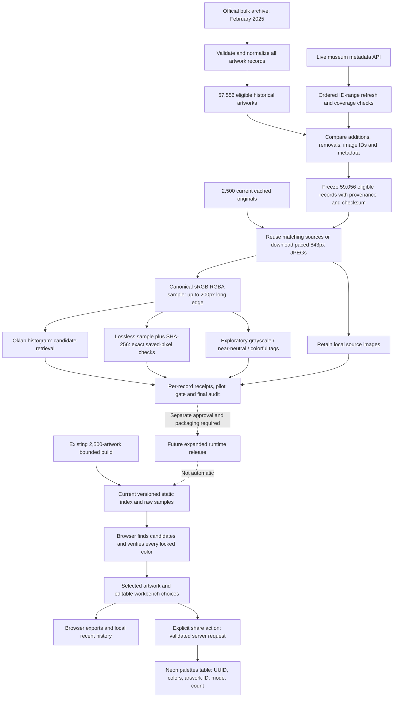

# How we built the artwork database and color index

[Documentation home](README.md) · [Architecture](architecture.md) · [Full-scan operations](full-color-scan.md)

## The short explanation

We start with the museum's artwork records, refresh them against the live catalog, and keep a reproducible list of eligible public-domain artworks. We analyze each available image into a compact color fingerprint and retain a small, exact pixel sample to check matches. The website searches these precomputed color records; a separate Neon database stores the palettes visitors choose to share.

The phrase “art database” is convenient product language. The current art-search implementation is **versioned JSON plus sample files**, not a table full of paintings in Postgres. Original JPEGs are retained locally during the scan, not inserted into Neon or bundled with the current website release.

## Visual graph


[Open the full-size SVG](diagrams/data-pipeline.svg). The graph is an editable vector asset with accessible title/description, not a screenshot or a live progress display.

### Editable Mermaid equivalent



Read the solid arrows as implemented data paths. Dashed arrows are a **future release boundary**, not evidence that the full scan is already in the app. Tone is an optional interpretation feature outside this database-building pipeline; it does not generate the index.

## 1. Establish a complete historical baseline

The museum's official data repository links to a bulk metadata archive; its GitHub JSON directory contains examples, not the whole collection. Bulk data provides a reproducible starting point without treating a relevance-ranked search sample as complete. See the [museum's data-dump guidance](https://api.artic.edu/docs/#data-dumps) and [official repository](https://github.com/art-institute-of-chicago/api-data).

On 2026-09-13, the downloadable archive was **119,891,546 bytes** and its HTTP last-modified date was **2025-02-16**. We did not silently treat that old snapshot as current. We retained it, validated its artwork member names/types, and extracted only the artwork JSON files—not its Git directory or unrelated resource folders.

The validated artwork subtree contained **134,078 regular, uniquely named records**. The [importer](../scripts/import-artwork-catalog.ts) checked identity, parsed rights flags, normalized display metadata, sorted IDs, and accounted for every record:

| Historical snapshot outcome | Count |
|---|---:|
| Public-domain artwork with usable image ID and title | 57,556 |
| Not explicitly marked public domain | 74,021 |
| Public-domain record without an image | 2,501 |
| Invalid image ID or blank title among otherwise eligible records | 0 |
| Total records accounted for | 134,078 |

Malformed input does not disappear into a success count. Invalid JSON, identity mismatches, unexpected files, and missing required rights flags stop import. Ordinary eligibility exclusions are recorded by ID and reason.

## 2. Reconcile against the live museum catalog

An old baseline cannot identify current additions, removals, changed images, or rights eligibility. The [live refresher](../scripts/refresh-artwork-catalog.ts) therefore collects the current eligible set directly, using explicit public-domain and image-presence filters.

It starts by recording the highest eligible artwork ID and expected total. Each following request asks for up to 100 records ordered by ascending ID, above the last collected ID and no higher than the fixed upper bound. This avoids relying on deep pagination beyond the search window.

Every page is saved. Its remaining-result count must equal the starting total minus records already collected. IDs must strictly increase, rows must validate, and the page must contain the expected number of entries. At the end, additional queries check the bounded total/highest ID and ensure no eligible artwork has appeared above the original bound. Drift prevents freezing the output.

This is strong accounting of a live observation window, **not a transactional snapshot of the museum's database**. An artwork's metadata could still change while other pages are being collected. The start and end timestamps are retained so the claim is explicit.

The first completed refresh ran from **02:59:02 to 03:08:55 UTC on 2026-09-13**:

| Live refresh result | Count |
|---|---:|
| Eligible artworks | 59,056 |
| Saved metadata pages | 591 |
| Added relative to the eligible historical baseline | 1,707 |
| No longer in the eligible result set | 207 |
| Existing entries with changed image IDs | 511 |
| Existing entries with changed normalized metadata | 5,496 |
| Existing originals eligible for reuse | 2,500 |

Changed-image and changed-metadata counts can overlap. “Removed” means absent from the new eligibility result, not a proven deletion or a particular rights change. The arithmetic `57,556 + 1,707 − 207 = 59,056` reconciles the eligible sets.

## 3. Freeze inputs and preserve provenance

`artworks.json` is the normalized version-1 catalog consumed by the batch processor. Companion provenance retains source and API update timestamps. Reconciliation retains the actual ID lists, not just summary counts. The completion report records the catalog's SHA-256 digest.

The initial frozen live catalog digest is:

```text
c8df17e09cbf77d1f1312460903e1e2ade5728d6593d851d3597ffd481ad3a38
```

The scan fingerprints normalized catalog content, ordering, reuse inputs, and recipe. Changing those inputs requires a new job directory. A catalog is not edited in place halfway through a scan; otherwise the cursor could refer to different artworks and previously generated records could be misattributed.

Reused originals must exist locally and match both the live image ID and source update timestamp. Matching only an artwork ID is not enough. A missing source explicitly named in a reuse manifest pauses processing rather than being silently replaced.

## 4. Download or reuse images carefully

The standalone batch command is offline by default. The explicitly approved full-scan runner enables downloads for eligible catalog entries not covered by reusable sources.

The implemented download contract is sequential requests, conservative one-second spacing, 843px museum JPEGs, no redirects, a ten-second request timeout, and a 10 MiB streamed size cap. The size cap also applies when a content-length header is absent or inaccurate. Successful network responses must declare JPEG content and start with JPEG bytes.

HTTP 403/404 and invalid/decode/empty-image cases receive explicit skip receipts. Network interruptions, rate limits, and other server failures pause the pending item and retry with backoff through the runner. A 403 is a recorded delivery result, not proof of a particular legal or copyright explanation.

Embedded JPEG ICC profiles are flagged for normalization and skipped by the batch path. The current pipeline does not implement ICC conversion. Reused images are subject to the manifest's sRGB contract; a declaration is not an automatic profile conversion.

## 5. Build color evidence from one canonical sample

The shared [image-preparation helper](../scripts/lib/color-image.ts) uses the installed Node image decoder and reduces the image to a maximum 200px long edge, preserving aspect ratio. It does not upscale small inputs. The exact resulting RGBA byte sequence is the canonical sample.

Three derived outputs come from those same pixels:

| Output | What is stored | Why it exists |
|---|---|---|
| Color signature | Oklab histogram bins and opaque-pixel count | Quickly narrow down possible locked-color matches |
| Verification sample | Dimensions, SHA-256, and losslessly saved RGBA bytes | Prove acceptance against the exact indexed pixels rather than a later re-decoding |
| Colorfulness tag | Tag, mean/maximum chroma, colored-pixel fraction, opaque count, recipe version | Explore grayscale/neutral content without excluding it |

Oklab bins use a 0.02 grid. Pixel alpha below 128 is ignored when analyzing color content. Other pixels—including black, white, gray, frames, and backgrounds—remain part of matching evidence. Equal canonical bytes share a sample file by digest, even when different artwork IDs refer to them.

The small palette visible in the app is **not** this fingerprint. A five-color summary can miss an accent that is important to a lock. Conversely, the browser palette extractor deliberately removes some extreme brightness values that the matching index retains.

### Grayscale tagging is deliberately conservative

Version 1 labels a sample grayscale only when maximum Oklab chroma is at most 0.005. Otherwise, fewer than 1% of opaque pixels at chroma at least 0.02 produces near-neutral; remaining images are labeled colorful.

These are project thresholds, not a universal art classification. A dark object with a small gold detail can be near-neutral rather than grayscale. A warm tinted print can count as colorful. Tags do not remove artworks, loosen matching, or claim independent human calibration.

## 6. Verify before advancing the checkpoint

Each artwork gets a receipt containing its normalized metadata and either its indexed result/source provenance or an explicit skip reason. The sample is written and verified before the record is accepted. The checkpoint advances only after the receipt verifies.

Files use same-directory temporary writes followed by atomic rename. If interruption occurs after the receipt but before the checkpoint update, restart verifies the saved receipt and rolls forward without another image download. Corrupt samples or inconsistent input identity stop processing instead of being silently repaired under the same fingerprint.

Routine resume checks the most recent committed receipt and any record ahead of the cursor. A full audit is separate: it decompresses and hashes every committed sample and recomputes signatures/tags. The scan runner also hashes each indexed original and compares its saved size. Atomic rename is protection against process interruption, not guaranteed power-loss durability or a substitute for backup.

## 7. Gate the larger run with a pilot

The first 300 records form a throughput/integrity pilot. It is not a random, independently labeled accuracy sample. At least 90% must index; the pilot then passes sample and original-hash audits before the runner continues.

The first pilot completed with **293 indexed and 7 HTTP-403 skips**. Its indexed records had 276 colorful, 8 near-neutral, and 9 grayscale tags. All original hashes and canonical samples verified. A grayscale sculpture photograph and a nearly neutral dragon with gold accents were also visually spot-checked; this is useful evidence, not a broad accuracy study.

A batch with at least 20 records and more than 20% failures pauses the run for inspection. Disk below 5 GiB free also pauses. The monitor can retry transient interruptions without bypassing those checks; see [operations](operations.md#scan-monitoring-and-restarts).

## 8. Keep staging separate from a runtime release

The current app uses a separately built **2,500-artwork** version-2 release. Its earlier bounded corpus was selected across ten search categories, expanded by reusing sources, and verified before the runtime path was switched. Older 481- and 965-artwork asset sets remain available for rollback.

The full scan writes per-artwork receipts and compressed `.rgba.gz` samples. The current runtime expects an aggregate `index.json`, matching `artworks.json`, and raw `.rgba` sample URLs. Completing the scan does not solve packaging, browser memory, query budgets, hosting size limits, accuracy review, or deployment approval.

No automatic full-scan-to-runtime publisher exists. No full-scan records are being inserted into Neon. Originals are retained; removing them requires separate approval after appropriate verification and backup decisions.

## Data dictionary and file contracts

| Artifact | Main fields | Invariant |
|---|---|---|
| Normalized artwork | `id`, `image_id`, `title`, artist/date/medium fields, rights flag, thumbnail metadata | Unique positive artwork ID; valid image ID; explicit public domain for indexed catalogs |
| Version-2 index entry | `artworkId`, `imageId`, `sourceUpdatedAt`, `signature`, `sample` | Entry identity matches catalog; sample descriptor binds exact bytes |
| Signature | `opaquePixels`, `bins` | Bin counts describe the canonical opaque sample |
| Sample descriptor | `width`, `height`, `sha256` | Byte length is `width × height × 4`; SHA-256 matches |
| Indexed receipt | `plan`, `status`, `artwork`, `entry`, `colorfulness`, `source` | Plan fingerprint and artwork agree; analysis verifies |
| Source provenance | `path`, `sha256`, `bytes`, `reused` | Local provenance, not a browser URL or public deployment asset |
| Skip receipt | `plan`, `status`, `artwork`, `reason` | Accounted failure is distinct from “analyzed and does not match” |
| Checkpoint | `cursor`, `indexed`, `skipped` | `indexed + skipped = cursor`, bounded by catalog size |

For newly downloaded batch entries, `entry.sourceUpdatedAt` can be null because the current batch interface gets per-entry timestamps from the reuse manifest. The live catalog's companion `provenance.json` retains those timestamps for all refreshed records. Preserve that file with the scan; do not infer that null means the museum record has never changed.

Version numbers are scoped: artwork catalog v1, color index v2, colorfulness v1, and a job recipe fingerprint are different contracts. A change to one does not automatically migrate the others.

## The separate saved-palette database

A visitor clicking Share sends a small validated palette to the server. The server creates a UUID and saves colors, artwork ID, mode, and count in Neon's `palettes` table. Opening `/palette/<uuid>` retrieves that saved selection and looks up the artwork's presentation metadata.

This is intentionally separate from art discovery and matching. A visitor's recent history stays in the browser, and downloading a local PNG/JSON/CSS/ASE does not require a Neon save. The [API reference](api-reference.md) contains the exact saved-palette schema and request boundary.
